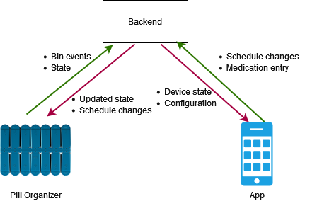
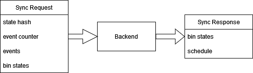
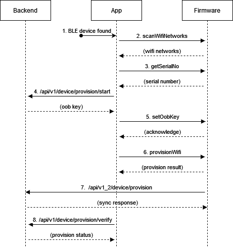

# Architecture Overview



The backend acts as a data broker between pill organizers and the app.
It is responsible for maintaining all data, and ensuring the system is safe and consistent.

## How state is managed

The state of a pill organizer is distributed between the firmware and the backend.
The backend maintains the authoritative state - generally it can override whatever the firmware thinks the state is in.
However, a key requirement of this project is that the pill organizer continues working while completely
disconnected from WiFi and Bluetooth. Thus the firmware maintains its own state as well, and a sync procedure keeps the
two consistent.

### What is state?

We consider the state of a pill organizer to be the operational data of the device.
State determines which LED should be lit on a particular bin (red/green/flashing etc.) and when a transition should
occur. State transitions are also used to dispatch notifications to users that they need to take their medication.

The device state is divided into 14 "**bin states**", referring to each physical bin on a pill organizer.
Since each bin operates more or less independently, the entire device state is simply the collection of these 14 bin
states.
In other words, the device state is an array of 14 bin states, ordered by [bin ID](#bin-ids).

We can define a bin state as a pseudocode structure:

```
struct bin_state {
    timestamp   scheduled_time;
    bin_status  status;
}

enum bin_status {
  DISABLED = 0;     // This bin is not scheduled
  TAKEN = 1;        // The medication in this bin has been taken already
  MISSED = 2;       // The medication in this bin was not taken as scheduled
  PENDING = 3;      // The medication in this bin should be taken at some time in the future
  TAKE_NOW = 4;     // The medication in this bin should be taken now
}
```

`scheduled_time` is the time when medication in this bin should be taken and is a Unix timestamp (seconds).
`status` indicates the operating status of the bin and generally reflects what LED is shown on device.

#### In the code

As of writing, state structures are defined in **three** places in the project:

 * **firmware/proto/pill.proto**: Protocol buffer definition for wire serialization.
 * **firmware/include/pill_types.h**: C structure for use within the firmware.
 * **backend/src/main/java/jct/pillorganizer/model/device/DeviceState.java**: Java model for persistence.

There is effort to move these definitions to a single place for easier maintenance.

### State hash

Because state is distributed between the firmware and backend, a way of quickly checking if two device states are the
same is needed.

Instead of manually comparing every field of the state, a CRC32 (little-endian) hash is computed over the fields of the state.
If the hashes match, it is safe to assume that the two states are the same. 

The hash is computed using the following algorithm. Order the bin states by bin ID.
For each bin state, digest the status as an 8 bit integer and digest the timestamp as a 64 bit integer.
The hash at the end is the state hash.

#### In the code

 * firmware/src/pill_state.c (`state_build_sync_request`)
 * backend/src/main/java/jct/pillorganizer/device/DeviceStateWrapper.java (`calculateStateHash`)

## How syncing works

A sync uploads data from the device to the backend and is *always* device-initiated.
The device initiates a sync at a certain frequency (currently roughly 20 second intervals)
or after an event is triggered. A sync is two-way.
First, the device uploads its state to the server, and the server replies with its state.
The device will always override its own state with the server, as the server is authoritative.



A sync is an HTTP PUT request to `/api/v1_2/device/sync` (direct device WiFi sync) or
`/api/v1/device/{id}/sync` (app-proxied Bluetooth sync).
The request content is the `SyncRequest` protobuf structure and the response content is the `SyncResponse` protobuf
structure. 

The state hash allows the server to short-circuit the sync process if the states are already the same.
The event counter is intended to be a counter of the total number of events triggered on the device in its lifetime,
however as of writing this behavior may be non-functional.
The events field contains all events recorded on device *since the last sync*.
The bin states field contains the device state.

The sync algorithm is as follows:

1. Process all events in the request (see below).
2. Update event counter and state hash in the backend's Device record.
3. If the backend is 28 events behind (i.e., over 28 events have occurred since last sync), accept the device's state as
truth, and update the backend state to match the device's.
4. Respond with the backend's state and the device's schedule.

See backend/src/main/java/jct/pillorganizer/device/DeviceStateWrapper.java (`sync`).


## How an event is recorded

Events are things that happen on a device that we care about.
We consider two events: a bin has opened, and a bin hasn't been opened when it is scheduled.
There used to be a third event (bin closed) however this is deprecated (though there might be references to it around
the codebase). Note that we use "bin closed" as our bin open event, since it fires after the user has finished using the bin.

Events are stored and processed on device and are then synced to the backend for persistence.
Since the device must function in offline mode, event processing is replicated in **both the backend and the firmware**.

Missed events are handled by simply updating the appropriate bin status to missed.
Bin open events are handled with the following process:

 * If the bin status is "take now", the bin moves to "taken".
 * If the bin status is "pending" or "missed":
   * If the bin was opened between the previous bin and the next bin, the bin moves to taken.
   * If the bin was opened after the previous bin but there is no next bin, the bin moves to taken.
   * If the bin was opened before the next bin but there is no previous bin, the bin moves to taken.
   * In all other cases, the event is recorded but the bin maintains its state.
 * All other statuses, the event is ignored.

All events are persisted into the database.

## How scheduling works

Right now, only a simple schedule can be programmed onto a device.
A simple schedule uses the same times every day, one for the morning bin and one for the evening bin.
Some groundwork has been laid to support more complicated schedules, but that has not been implemented at this time.

The schedule of a device is stored as an array of 14 schedules, one for each bin.
A bin schedule can be defined with the following pseudocode structure:

```
struct bin_schedule {
    uint32      seconds_from_00;
    DayOfWeek  dayOfWeek;
}
```

The day of week indicates which day of the week the bin is scheduled on, whereas the `seconds_from_00` indicates when
on that particular day the bin should be opened, in day-epoch format.

This structure exists in the firmware (`bin_schedule_t`), the backend (`DeviceSchedule`) and in the protobufs (`BinSchedule`).

When a user updates their simple schedule, the following things happen:

1. All DeviceSchedule entries for the device are updated with the new times.
2. The state is rebuilt (see below).
3. The next time the device syncs to the backend, the backend replies with the new schedule and state.
4. The device updates its internal bin schedule and rebuilds the state.

### Status transitions

Status transitions are when a bin state moves from one status to another due to some time having passed.
One moves bins from "pending" to "take now" when the scheduled time of that bin has passed.
The other moves "take now" to "missed" if the bin isn't opened within **10** minutes of its scheduled time.
We consider the 10-minute miss interval to be the "**missed dose threshold**".
Code to handle these transitions are found in both the firmware and backend.


### State rebuilds

Since a bin state contains a "scheduled time" field, this field can get out of date when the user changes their schedule.
State rebuilding synchronizes the scheduled time fields with the device's schedule.

The rebuild algorithm loops through all bin states that are *not* taken or missed (that is, are disabled, pending, or take now).
The bin's scheduled time is updated to the new time.
If the new scheduled time is after the missed dose threshold, it is set to pending.
Otherwise, it is set to disabled.

This rebuild function exists in both the backend (`DeviceStateWrapper`) and firmware (`state_rebuild_schedule`).

### Pill Reloading

Pill reloading is handling when the user fills their pill organizer with pills again at the end of the week.
The pill reload procedure is very simple.
The device state is reset, so all bins are disabled and their scheduled time cleared.
Then the state is reset.

We are left with a "clean slate" and the device is ready to be used for another week.

(this process has a number of limitations and needs to be revisited)

## How provisioning works


We use the Wifi provisioning system built in to the esp-idf, but we use a couple of custom endpoints to transfer our application-specific data.
On the app side, we use a custom forked version of flutter_esp_ble_prov with a number of patches.



1. The app scans for BLE devices.
   For best support between iOS and Android, we look for devices starting with "CAB_".
2. When a matching device is found, we scan for WiFi networks (handled by idf). 
   Present the user with a list of networks.
3. Call the `serial-no` custom endpoint to get the device's serial number.
4. Start provisioning with the backend, using the serial number to get an OOB key.
   This is a shared key between the backend and firmware, used for authentication.
5. Call the `provision-key` custom endpoint, writing the OOB key to the device.
6. Call into the idf's provision function, writing the WiFi credentials to the device.
7. When the device connects to WiFi, it makes an HTTP request to the backend indicating that provisioning was successful.
8. The app polls the provision verify API endpoint until success.

**NOTE**: the firmware uses ESP provisioning in "security 0" mode.
We need to use a secure mode and figure out how to distribute POP keys before production.
